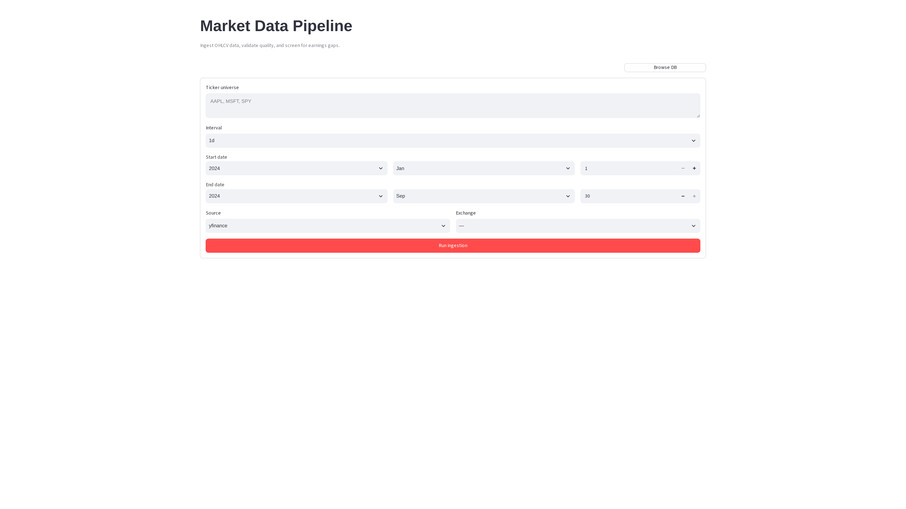
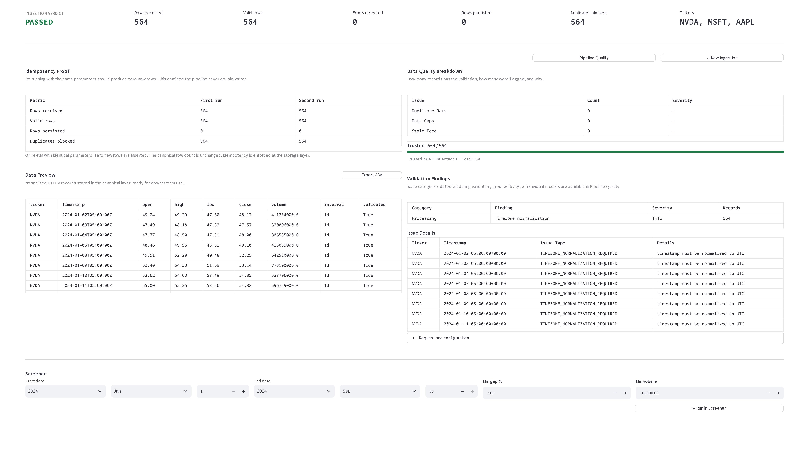

# Market Data Pipeline

A financial market-data pipeline that validates, normalizes, persists, and audits OHLCV data before it reaches downstream analytics.

> Garbage in, garbage out. This pipeline ensures that downstream models and screeners receive only data that has passed a structured quality audit.

---

## Overview

Raw OHLCV data from public providers contains a range of silent defects: duplicate candles, missing intervals, stale responses that arrive as HTTP 200, prices that violate OHLC relationships, and timezone inconsistencies. Analytics that consume this data inherit those defects without knowing it.

This pipeline intercepts every ingestion request, validates the response against a set of explicit data-quality rules, and persists a structured record of every defect it finds. Data that passes validation is stored as trusted bars, available for downstream use. Defects are recorded and visible — never silently repaired.

An earnings gap screener is included as the first downstream consumer of the validated data.

---

## Why This Matters

A missing interval in daily bar data looks like a flat period in a backtest. A stale feed that returns yesterday's close as today's open is invisible to any model that does not check the timestamp against the expected freshness boundary. Duplicate candles inflate volume and distort momentum signals.

None of these problems raise an exception. They produce plausible-looking outputs from incorrect inputs.

The pipeline's purpose is to make these failures explicit and traceable, not to silently repair them.

---

## Key Features

- **Structured ingestion audit** — every batch records a PASSED / PASSED WITH ISSUES / REJECTED verdict with per-defect-type counts
- **Six validation rules** — duplicate bars, missing intervals, stale responses, invalid prices, OHLC inconsistency (high < low), timezone normalisation
- **Exchange-aware gap detection** — daily interval gap checks respect market calendar (weekends skipped; optional exchange calendar support)
- **Staleness detection** — daily and intraday freshness boundaries are checked independently
- **Custom HTTP provider support** — any JSON OHLCV endpoint can be used alongside yfinance
- **Idempotent writes** — re-ingesting the same range does not duplicate records
- **Earnings gap screener** — screens validated bars for post-earnings opening gaps, relative volume, and intraday close return
- **REST API** — full ingestion and screener pipeline exposed via FastAPI
- **Streamlit dashboard** — visual ingestion form, quality verdict panel, idempotency proof, and screener UI
- **PostgreSQL storage** — structured schema with Alembic migrations

---

## Example Result

**Demo:** AAPL, MSFT, SPY · daily · 2024-01-01 to 2024-09-30

| Metric | Value |
|---|---|
| Records received | 567 |
| Records valid | 561 |
| Duplicate bars | 0 |
| Missing intervals | 4 |
| Stale responses | 2 |
| Invalid prices | 0 |

**Verdict: PASSED WITH ISSUES**

Four missing intervals were detected across the requested range. Two staleness flags were raised. All defects are recorded with ticker, timestamp, batch ID, and source. Validated bars are available for downstream queries.

---

## Screenshots

### Ingestion form



### Quality verdict panel



---

## How It Works

```text
Ingestion request (tickers, interval, date range, source)
  ↓
Rate-limited, retry-wrapped provider fetch (yfinance or custom HTTP)
  ↓
Staleness check (is the response fresh enough?)
  ↓
Normalisation (timezone, ticker case, numeric types, schema)
  ↓
Validation (duplicates, gaps, prices, OHLC consistency, stale flag)
  ↓
Idempotent write (raw bars → trusted bars, only if valid)
  ↓
Batch record (verdict, defect counts, timestamps)
  ↓
Screener query (earnings gap candidates from trusted bars only)
```

**Normalisation** converts timestamps to UTC, standardises ticker case, and ensures numeric columns are finite floats. Schema validation rejects any response that is missing required columns.

**Validation** runs six independent checkers. Each produces a list of `ValidationIssue` records with type, severity, ticker, timestamp, batch ID, and source. No checker silently repairs data.

**Idempotent writes** use a unique constraint on (ticker, timestamp, interval, source). Re-ingesting the same range produces idempotent conflict records, not duplicate bars.

**Screener** reads only from validated trusted bars. It computes opening gap percentage, relative volume (vs. 20-day average), and intraday close return for each candidate date.

---

## Methodology

### Validation Rules

| Rule | Issue Type | Severity |
|---|---|---|
| Duplicate timestamp for same ticker/source | `DUPLICATE_CANDLE` | ERROR |
| Missing expected interval in sequence | `MISSING_INTERVAL` | WARNING |
| Provider response older than freshness boundary | `STALE_RESPONSE` | WARNING |
| Zero, negative, or non-finite OHLC price | `INVALID_PRICE` | ERROR |
| High price below low price | `OHLC_INCONSISTENCY` | ERROR |
| Timestamp not in UTC | `TIMEZONE_NORMALIZATION_REQUIRED` | INFO |

### Staleness Detection

Intraday intervals (1m, 5m, 1h) are checked against the exact requested end timestamp. Daily and longer intervals use a market-session boundary: the latest bar must cover the last expected trading session for the requested range. Weekend days are excluded automatically; exchange calendars are supported optionally.

### Earnings Gap Screener

For each ticker in the universe, the screener:

1. Fetches earnings announcement dates via yfinance
2. Derives the gap date — same day for pre-market announcements, next trading day for post-market
3. Queries trusted bars for the gap date and the prior trading day
4. Computes gap percentage `(open / prior_close - 1)`, relative volume `(volume / 20d avg)`, and close return `(close / open - 1)`
5. Filters by configurable minimum gap percentage and minimum volume thresholds

---

## Tech Stack

- Python 3.12
- FastAPI, Uvicorn
- SQLAlchemy 2.0, Alembic
- PostgreSQL, psycopg3
- Pydantic v2
- pandas
- yfinance
- Streamlit
- Docker
- Redis (optional, for caching)
- exchange-calendars (optional, for exchange-aware gap detection)

---

## Running Locally

### 1. Clone

```bash
git clone https://github.com/<username>/market-data-pipeline.git
cd market-data-pipeline
```

### 2. Configure environment

```bash
cp .env.example .env
# edit .env — set DATABASE_URL to your PostgreSQL instance
```

### 3. Install dependencies

```bash
pip install uv
uv sync --extra dev
```

### 4. Run database migrations

```bash
uv run alembic upgrade head
```

### 5. Start the API

```bash
uv run uvicorn src.api.main:app --port 8001
```

### 6. Start the dashboard

```bash
uv run streamlit run app/main.py --server.port 8504
```

### Docker (alternative)

```bash
docker compose up
```

Starts PostgreSQL, the FastAPI service, and the Streamlit dashboard together.

---

## Input Format

### Ingestion request (API)

```json
{
  "ticker_universe": ["AAPL", "MSFT"],
  "interval": "1d",
  "start_time": "2024-01-01T00:00:00",
  "end_time": "2024-09-30T23:59:59",
  "source": "yfinance",
  "exchange": null
}
```

For custom HTTP providers, add:

```json
{
  "source": "custom",
  "custom_url": "https://myapi.com/ohlcv?ticker={ticker}&start={start}&end={end}&interval={interval}",
  "api_key": "optional-bearer-token"
}
```

URL template placeholders `{ticker}`, `{start}`, `{end}`, and `{interval}` are substituted at request time.

### Expected JSON response format (custom provider)

```json
[
  {
    "ticker": "AAPL",
    "timestamp": "2024-01-02T00:00:00",
    "open": 185.0,
    "high": 188.0,
    "low": 184.0,
    "close": 187.0,
    "volume": 1000000
  }
]
```

---

## Project Structure

```text
.
├── app/
│   └── main.py             # Streamlit dashboard
├── src/
│   ├── domain.py           # Domain types and enums
│   ├── config.py           # Environment configuration
│   ├── api/                # FastAPI routes, schemas, facade
│   ├── ingestion/          # Coordinator, client, staleness, rate limit, retry
│   ├── normalization/      # Timezone, ticker, numeric, schema normalisation
│   ├── validation/         # Six validation checkers + orchestrator
│   ├── storage/            # SQLAlchemy models, repositories, unit of work
│   └── screener/           # Earnings gap query service and calculations
├── migrations/             # Alembic migration files
├── tests/
├── .env.example
├── docker-compose.yml
├── Dockerfile
└── pyproject.toml
```

---

## Testing

```bash
# Unit tests (no database required)
uv run pytest -m "not integration"

# All tests (requires PostgreSQL)
uv run pytest
```

Unit tests cover:

- All six validation rules, valid and invalid inputs
- Staleness detection for intraday, daily, and weekly intervals
- Custom HTTP client: URL expansion, bad-row preservation, bearer token, error handling
- Normalisation correctness: timezone conversion, numeric parsing, schema enforcement
- Screener calculations: gap percentage, relative volume, close return
- Idempotency: repeated writes must not duplicate records

Integration tests use testcontainers to spin up a real PostgreSQL instance.

---

## Reproducibility

Ingestion results are deterministic for the same ticker universe, interval, date range, and provider response. The validation suite produces the same defect records for the same input.

The earnings gap screener uses a configurable random seed for any stochastic operations.

---

## Limitations & Assumptions

- Price data from yfinance is subject to its own availability and accuracy constraints. The pipeline detects and flags defects; it cannot correct errors in the source data.
- Missing interval detection assumes bars should exist on every expected trading day. Market-specific holidays are not handled unless an exchange calendar is configured.
- The custom HTTP provider must return a JSON array in the documented format. Other response structures are not supported.
- This is a data reliability tool, not a real-time streaming system. It does not support WebSocket feeds, Kafka, or sub-second intervals.
- The earnings gap screener uses yfinance for earnings date data, which may be incomplete or delayed.

---

## Possible Extensions

- Additional data provider adapters (Alpha Vantage, Polygon, Quandl)
- Real-time staleness alerts
- Data quality trend dashboard across batches

---

## Disclaimer

This software is provided for research and educational purposes only. It does not constitute investment advice.
